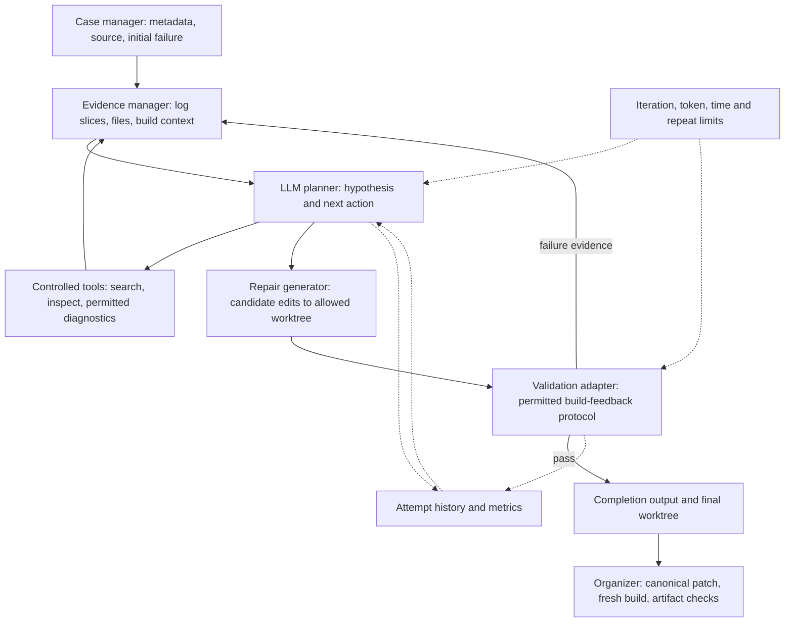

# Design Proposal

**Build-Bench Challenge: Autonomous LLM Agents for Cross-Architecture Package Repair**
**Team:** Anthony Capraru, Austin Li, Joonseo Moon, Juliette Jacques, Owen Zhang
**Mentor:** Minghua Ma, Microsoft
**Demo 1:** September 23, 2026. Materials are due at noon on `demo-1`.

This is a design proposal. All agent modules and evaluation targets below are proposed; the completed work is the dataset inspection and starter-kit smoke run. We retain the course template's six sections. Milestones are proposed commitments for team review before submission.

## 1. Problem

Package maintainers must diagnose software that builds on one instruction set architecture but fails on another. Failures can arise from source assumptions, dependencies, compiler flags, build-system configuration, tests, or packaging. Manual repair requires moving between long logs, unfamiliar source trees, and build metadata, then rebuilding to determine whether a change helped.

We propose a general LLM repair agent that gathers evidence, forms and revises a root-cause hypothesis, edits permitted package files, and requests validation within a fixed resource budget. The desired benefit is less manual investigation with independently verifiable repairs. We will measure repair success and resource cost; this project does not yet measure developer time saved.

**Scope.** Our downloaded release has 200 Debian source-package cases across 188 packages: 100 x86_64-to-aarch64 and 100 in the reverse direction. The competition also advertises RISC-V migrations, but this release contains no RISC-V cases. Initial course experiments cover the two available directions. RISC-V support depends on released cases and permitted infrastructure. [1, 3]

**Non-goals for Demo 1.** Implementing an agent, making case-specific hard-coded fixes, modifying the organizer's runner to pass, training a model, and claiming hidden-case performance. No competition registration or qualification is claimed.

## 2. Proposed design

### Execution contract

An agent receives case metadata and initial failure evidence in `/workspace/input`, edits only the permitted repository under `/workspace/work/repo`, and writes structured completion output under `/workspace/output`. The platform derives a canonical patch, applies it to a fresh case, runs the official target build, and checks expected artifacts. Agent completion alone does not establish repair success. We will follow the submission checks, including `agent-result.json`, a README, and exactly pinned dependencies. [1, 4]

The agent will use only permitted tools. It must not receive a Docker socket or start the validator directly. The controller adapts to the organizer's model-access and build-feedback protocol. The supplied local runner disables agent networking and does not expose a usable iterative model/validation client, so those interfaces must be confirmed before implementation. Local hello testing is already available; arbitrary public-case execution is not yet established.

### Architecture

| Component | Responsibility and boundary |
| --- | --- |
| Case manager | Normalize package, architecture, build-stage and input paths without altering the original evidence. |
| Evidence/context manager | Stream logs, retain diagnostic windows and source locations, collapse repetitions, and retrieve relevant source/build/dependency files within the context budget. |
| Planner and repair generator | Record a falsifiable hypothesis, select a tool or candidate edit, and explain which observed failure the edit addresses. |
| Controlled tool executor | Allow repository search, file inspection, diff inspection, and permitted diagnostic commands. Restrict paths, command duration and output size. |
| Validation adapter | Request supported feedback and classify build failure, timeout, invalid patch, and infrastructure error. Final scoring stays with the organizer. |
| History, budgets and metrics | Persist hypotheses, patch hashes, normalized failure signatures, validation results, usage and termination reasons. |

### Repair loop and decisions

1. **Observe:** identify the failing stage and preserve diagnostic provenance, including file paths and log offsets.
2. **Diagnose and inspect:** form a hypothesis, select relevant files/tools, and gather confirming or contradicting evidence.
3. **Repair:** make a bounded candidate change and inspect its diff. Preserve tests and required artifacts; do not treat disabling checks as a general repair strategy.
4. **Validate:** request the allowed build feedback and record the resulting status and evidence.
5. **Revise or stop:** update the hypothesis on failure. Stop on verified feedback success, exhausted budgets, or a repeated unchanged failure/patch pair. The platform still performs the final clean validation after exit.

We choose bounded evidence retrieval over placing the entire repository and log in context. One downloaded libyuv log is 2.37 GB; noisy repetition would crowd out the relevant source and diagnostics. We choose iterative diagnosis over a single prompt because validation can contradict the first hypothesis. We choose a small explicit state machine and append-only attempt records over an unconstrained conversation so experiments can explain failures and enforce limits. We choose official fresh-build validation over the model's own confidence or an incremental workspace build. [3, 4]

Initial configurable research limits are **5 repair candidates, 30 minutes total wall time per case, 30,000 model tokens, and 2 repeated identical failure/patch pairs**. These are proposed caps, not published competition limits. Use the stricter organizer cap where applicable and freeze the actual settings before comparison. Record token categories supported by the provider; unknown usage stays unknown, never zero. The wall-clock budget includes tool and build requests.

## 3. What makes this hard

The hardest challenge is selecting the next useful evidence or repair action under an expensive, incomplete feedback loop. A compiler error may be downstream of a dependency problem, and a cross-architecture failure may actually occur during packaging. Repeated noisy logs can hide the causal diagnostic. The planner must connect architecture and build-system facts to a hypothesis, choose an informative tool call, and revise after a failed build without cycling through the same edits.

This requires more than an API call: bounded log extraction with provenance, tool and state management, reproducible validation integration, failure classification, and cost-aware stopping must work together. Our central experiment will test whether evidence selection and repair history increase verified repairs or reduce model usage compared with the Demo 2 prototype. Failure labels from the current log scan are heuristic signals, not established root causes.

## 4. How you will know it worked

**Primary metric:** Verified Build Success Rate = cases whose canonical patch applies, clean target build succeeds, and required artifacts pass verification / all cases in the frozen evaluation set. Report numerator and denominator. Timeouts, invalid patches, crashes, and unresolved cases remain in the denominator. Report infrastructure failures separately without silently removing them; any secondary rate restricted to runnable cases must identify that denominator.

**Secondary metrics:** total wall time, model token usage, repair candidates, tool calls by type, termination reason, and results by migration direction. Report per-case records and medians, plus failure categories only when manually supported. Build success demonstrates the benchmark outcome, not unrestricted semantic correctness.

**Comparison plan.** Reproduce the organizer-linked baseline under matching case versions, model, tool access and budgets where compatible. Preserve its commit and configuration. The supplied hello example is a hard-coded smoke test and cannot establish a general-agent baseline. If the organizer baseline cannot run with the current protocol, document the mismatch and use a clearly named one-shot LLM comparator as an interim baseline. Do not label that substitute official. [1, 4]

Freeze 10 public cases for Demo 2, aiming for five per direction. For the final, target 40 cases, 20 per direction: the original 10 plus 30 held out from prompt/strategy tuning. Group repeated package names across splits, choose cases before inspecting repair outcomes, and preserve the selection manifest. Freeze the final held-out set before Demo 3 optimization. If environment availability prevents these targets, announce and justify the revised scope at a demo rather than silently changing the set. These small public subsets do not estimate hidden leaderboard performance.

Use the same model/configuration and case snapshot for paired comparisons. Run each compared configuration once on the full selected set, then repeat three times on the cases that establish the claimed Demo 3 gain. Report all repeats and regressions. A claimed one-case improvement must persist in at least two of those three repeats. Freeze the improvement criterion before optimization.

### Current evidence, September 21

- Downloaded materials were inventoried and archived. Dataset checks covered 1,510 listed checksums and 705 per-case source entries with no mismatches. The release contains 200 cases and 188 packages. [3]
- The unmodified rc.2 starter kit, with documented runtime-image overrides, ran its supplied hello example on the team's Linux VPS. The initial build failed, the example agent completed, the canonical patch applied, and final validation succeeded with build exit code 0 and two verified RPM artifacts. Both downloaded artifact hashes were checked. [4]
- The final validator build reported **9 seconds**. This is one x86_64 hello run, with an architecture-independent RPM and a known marker-replacement repair. It is not a cross-architecture experiment, total agent runtime, LLM benchmark, or repair-rate result on the development cases.
- General repair-agent implementation, public-case baseline evaluation, model/protocol integration, and competition qualification remain pending. The mentor direction in the team brief supports diagnosis, harness design, repair and validation; no meeting transcript is present in the repository.

## 5. Milestones

Dates below follow the course repository template. Targets are intentionally measurable and must be reviewed by the team before submission. [2]

| Demo | Date | Milestone | How we will demonstrate it |
| --- | --- | --- | --- |
| Demo 2 | 10/21 | Compatible end-to-end LLM prototype; reproduce starter workflow and baseline or document compatibility blocker. | Runnable packaged agent and exact command. Trace shows input, model call, file inspection, candidate edit, completion output and clean validation. Preserve versions and limits. |
| Demo 2 | 10/21 | Freeze and evaluate 10 public cases, aiming for 5 per direction. | Checked-in case manifest and reproducible experiment command. Per-case verified status, wall time, tokens, attempts and tool calls, including failures. No minimum repair rate promised. |
| Demo 3 | 11/16 | Categorize Demo 2 failures and implement one evidence-driven improvement. | Failure taxonomy with concrete traces, changed module, and an ablation or controlled comparison isolating the change. |
| Demo 3 | 11/16 | Measured improvement on the same 10 cases. | Target at least 1 additional verified repair, or equal repair count with at least 20% lower aggregate model tokens. Hold model and budget ceilings fixed, disclose regressions, and repeat gain-defining cases as specified above. Missing usage cannot satisfy the token criterion. |
| Final | 12/09 | Stable agent and reproducible evaluation on the proposed 40-case set. | Pinned dependencies, agent version, case manifests, exact setup/commands, expected outputs, raw records, limits and failure analysis. Compare official baseline where reproducible, Demo 2, Demo 3 and final versions under a documented common setup. |
| Final | 12/09 | Competition-ready packaging and qualification attempt if infrastructure and progress permit. | Archive validation report and submission/qualification receipt or a specific blocker. A competition version must be ready **before the currently published November 13 freeze**, not at the December final. Registration remains unverified. |

Milestone changes must be announced with justification at the demo. A missed target is reported as a miss; it is not retroactively relabeled as success. The competition website lists results by November 20. Recheck those external dates before entering. [1]

## 6. Risks

| Risk | Mitigation and evidence needed |
| --- | --- |
| Public development inputs are not complete runnable validator cases | First reconstruct one permitted Debian case and reproduce its original failure. Confirm manifests, frozen dependencies, source materialization and build configuration with organizers. Keep the hello smoke result separate. |
| Local runner has no demonstrated model/iterative feedback client | Resolve supported model gateway and feedback API before implementing the loop. Preserve runtime isolation; do not add a Docker socket or assume outbound networking. |
| Sparse, misleading or huge logs | Stream and deduplicate with source offsets; measure extraction failures and inspect representative traces. |
| Hallucinated edits or package-specific overfitting | Validate clean builds, retain required tests/artifacts, review recurring failure categories, and hold out package groups from tuning. |
| Limited compute, tokens or target architectures | Current VPS is x86_64 with 2 CPUs and about 3.7 GiB RAM. ARM64/RISC-V execution and concurrent build capacity are unverified. Secure permitted target resources, run serially initially, and report resource failures. |
| Performance gain does not materialize | Keep the predefined comparison, show negative results/regressions, and announce any scope revision. Do not cherry-pick successful cases. |
| Competition and course timelines differ | Decide participation early. Prepare qualification before the November 13 external freeze, ahead of Demo 3. |

**Team decisions still open:** model/provider and spending budget; protocol and target-build access; case selection and attainable case counts; final per-case caps; module ownership; the two Demo 1 presenters; and competition participation. The course permits at most two presenters per demo and requires every member to present at least once across the three demos. [2]

### References

1. [Official Build-Bench Challenge](https://matrix.cstcloud.cn/build-bench/), inspected September 21, 2026: execution/scoring, architecture scope, organizer baseline link and timeline. [Organizer-linked baseline repository](https://github.com/AIOps-Lab-NKU/BuildBench-Agent-Baseline). Baseline compatibility and results have not been verified. The site cites Zhao et al., [Can Language Models Go Beyond Coding?](https://arxiv.org/abs/2511.00780); no literature performance number is used as our baseline.
2. [EC528 grading and presentation requirements](https://ec528.github.io/ec528/fall26/grading/) and [submission instructions](https://ec528.github.io/ec528/fall26/setup/). Demo dates are from this repository's original proposal template. Rubric and presenter/quiz requirements were checked on the official grading page September 21.
3. [Dataset summary and provenance](evidence/demo-1/dataset-summary.json), derived from `analysis/dataset-analysis.json` inside the [downloaded materials snapshot](../../materials/README.md). Full analysis and input hashes reside in that snapshot.
4. [Archived hello results and reproduction instructions](evidence/demo-1/README.md). Interface descriptions also come from the supplied rc.2 starter kit's README, AGENTS.md and runner inspection. The starter kit is intentionally outside this Git repository.
