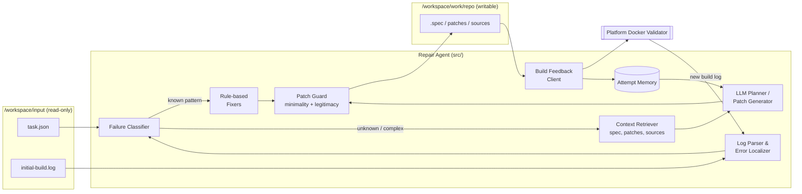

# Design Proposal

*Due in the `demo-1` branch at 12:00 noon on 09/23. This document is what your
progress is graded against for the rest of the semester — see the
[progress rubric](https://ec528.github.io/ec528/fall26/grading/#progress).*

**Team:** Joonseo Moon, Austin Li, Owen Zhang, Juliette Jacques, Anthony Capraru
**Mentor:** Minghua Ma (Microsoft)

> **Draft v0.1.** Items marked **TODO** need a team decision or mentor confirmation before submission.

## 1. Problem

Linux distributions ship tens of thousands of packages, and each one has to build
on every architecture the distribution supports (for openSUSE, x86_64, aarch64,
ppc64le, s390x and riscv64). A package that builds on x86_64 often fails
on another architecture. Common causes include:

- x86-only intrinsics or inline assembly (`<immintrin.h>`, `__asm__`),
- hard-coded architecture assumptions: `char` signedness, page size, `long double`
  width, endianness, `-m64`/`-msse` compiler flags,
- `%ifarch` gaps or `ExcludeArch` lines in the RPM `.spec` file,
- dependencies that are missing on the target architecture, or tests that time out
  there.

**Who has this problem today:** distribution packagers and porting teams, such as
openSUSE/SUSE, Fedora and Debian porters and cloud vendors moving workloads to Arm.
Today a human reads a build log that can run to thousands of lines, finds the root
cause, edits the spec or adds a source patch, and resubmits the package to the build
service. They repeat this until it builds. This takes a lot of skilled effort,
and it's the main thing holding back new architectures such as riscv64.

**Build-Bench** is a benchmark for this task. An agent gets a package that fails to
build for a target architecture, along with the failing build log. It must edit the
package worktree until the organizer's Docker Validator (OBS `obs-build` in a
container) produces the expected RPM/SRPM artifacts. Success is measured by the
build completing, not by matching a reference patch.

Our goal is to build a **Repair Agent** that scores well on Build-Bench. Along the
way we'll learn which kinds of cross-architecture failures LLM agents can and
cannot fix.

## 2. Proposed design

### 2.1 Constraints we design around

These constraints come from the starter kit (`buildbench-starter-kit-0.1.0-rc.2`).
They shape the whole design:

| Constraint | Source | Consequence |
| --- | --- | --- |
| Agent is a Python 3.11 program in a managed runtime, packaged as a ZIP | `agent.yaml`, `AGENTS.md` | No custom container, and every dependency is pinned in `requirements.lock` |
| Agent reads `/workspace/input` (read-only) and may only edit `/workspace/work/repo` | runtime interface | All repairs are file edits. The platform computes the canonical `repair.diff` |
| Agent container runs with `--network none`, 1 CPU, 1 GB RAM, 128 PIDs, read-only root, 64 MB `/tmp` (local runner) | `runner/run-agent-case.sh` | We can't run a local LLM. How the agent reaches a model during evaluation is **still open** (see Risks) |
| Build feedback comes through a platform protocol, with a limited number of attempts | `README.md` "Runtime interface" | Every build attempt is expensive, so the agent must reason as much as possible *before* each build |
| Agent must be deterministic and non-interactive | `AGENTS.md` | Temperature 0, fixed seeds, and a bounded number of steps |

### 2.2 Architecture

**Pipeline, per case:**

1. **Log Parser & Error Localizer.** This step turns a raw OBS log of thousands of
   lines into a short *failure digest*: the failing phase (`%prep`, `%build`,
   `%check`, `%install`, or dependency resolution), the first real error line, the
   surrounding compiler or linker output, and the file:line locations it refers to.
   It's plain Python with regexes and heuristics, and doesn't use an LLM.
2. **Failure Classifier.** This step puts the digest into one of our failure classes:
   `missing-build-dep`, `arch-intrinsics/asm`, `compiler-flag`, `type-width/signedness`,
   `test-failure`, `spec-arch-conditional`, `file-list/packaging`, or `unknown`.
3. **Rule-based Fixers.** These are deterministic, cheap edits for common,
   well-understood classes. Examples: add a `%ifarch` guard, drop `-msse*` flags on
   non-x86, or add a missing `BuildRequires`.
4. **Context Retriever.** For everything else, this step picks the few files that
   matter (the `.spec`, patches already in the package, the source file named in the
   error, the build system files) so that the LLM prompt stays small.
5. **LLM Planner / Patch Generator.** The LLM proposes a *diagnosis* first and then
   an edit, written as a unified diff or as structured search/replace blocks.
6. **Patch Guard.** Before an edit is applied, this step rejects edits that "win" by
   dodging the problem: adding `ExcludeArch`, deleting `%check` wholesale, emptying
   `%files`, or touching files outside the repo. It also checks that the diff applies
   cleanly.
7. **Build Feedback loop.** This step submits a build through the platform protocol
   and parses the new log. If the build fails again, the new digest and the previous
   attempts (from Attempt Memory) go back to the planner. The loop stops on success,
   when the attempt budget runs out, or when the same error repeats.

### 2.3 Design decisions and rejected alternatives

| Decision | Chosen | Rejected alternative | Why |
| --- | --- | --- | --- |
| Agent loop | Explicit staged pipeline, with the LLM called only for diagnosis and patching | A generic ReAct / "shell agent" that runs arbitrary commands | Build attempts are scarce and the sandbox has no network, 1 CPU and 1 GB of memory. A free-form agent wastes attempts and is hard to keep deterministic |
| Log handling | Deterministic digest before any LLM call | Pass the whole log (or its tail) to the LLM | Logs are long, and the root cause is often far from the tail. Cutting tokens also cuts cost and variance |
| Common failures | Rule-based fixers first, LLM as fallback | LLM for everything | Rules are free, reproducible and easy to explain, and they give us a strong baseline to measure the LLM against |
| Edit format | Structured search/replace blocks, validated before they're written | The LLM rewrites whole files | Whole-file rewrites break large `.spec` files and produce noisy diffs |
| Legitimacy | Patch Guard blocks "cheating" fixes | Accept any edit that makes the build pass | Disabling the architecture or the tests isn't a real repair. **TODO:** confirm with the mentor how the hidden evaluation treats these |
| Framework | Plain Python with a thin LLM client | LangChain, AutoGen, etc. | These add many pinned dependencies to the ZIP and hide control flow. **TODO:** revisit if we need their tooling |

## 3. What makes this hard

**Tracing a build failure on a foreign architecture back to a minimal, correct source
or spec change, while every check costs a build attempt.**

We can't just wire an LLM API to the build log, for four reasons:

- **The signal is buried.** OBS logs mix dependency resolution, `configure` output
  and parallel `make` output, and each failure can trigger many follow-on errors.
  The line that fails the build (`error: Bad exit status from ... (%build)`) is almost
  never the root cause.
- **The fixes need architecture knowledge the log doesn't contain.** For example,
  "`_mm_crc32_u32` undeclared" on aarch64 might be fixed with an ACLE equivalent, a
  portable fallback, or a `%ifarch` guard. The right choice depends on the upstream
  code base, and the log says nothing about it.
- **Feedback is expensive and limited.** Each build takes minutes and attempts are
  capped, so ordinary try-and-see debugging isn't possible. The agent has to decide
  where to spend its attempts.
- **There's no reference patch to aim at, and there are easy wrong answers.** Many
  edits make a build "succeed" without fixing anything. Telling a real repair from a
  cheat is part of the problem.

## 4. How you will know it worked

**Evaluation set.** The starter kit only includes the `hello` example case. We'll
build a local **dev set of ≥ 20 cross-architecture failure cases**. Candidate sources
are Build-Bench cases the organizers release, and openSUSE OBS packages whose build
history shows a failure followed by a fix for aarch64 or riscv64. For each case we'll
keep the fixing commit only for later grading, and never give it to the agent.
(**TODO:** confirm with the mentor which cases may be used locally.) The hidden
competition set is the final judge.

**Metrics** (computed by `experiments/eval.sh` over the dev set):

| Metric | Definition |
| --- | --- |
| **Repair rate** (primary) | % of cases where the validator produces all expected artifacts after the agent runs |
| Legitimate repair rate | Repair rate after we manually review each diff and exclude cheats (`ExcludeArch`, disabled tests, emptied `%files`) |
| Build attempts per case | Mean number of attempts used, for solved and unsolved cases |
| Cost | LLM tokens and wall-clock time per case |
| Patch size | Lines changed in `repair.diff`. Smaller is better at equal correctness |

**Baselines:**

1. **Example agent**: the starter kit's `example-agent`, which should score about 0%
   outside `hello`.
2. **Rules-only**: our pipeline with the LLM disabled.
3. **Naive LLM**: one prompt containing the last N lines of the log and the `.spec`,
   applied once, with no feedback loop.
4. **Full agent**: the complete pipeline.

**Success criteria:**

- The full agent solves **≥ 2× as many dev-set cases as naive LLM**.
- It achieves **≥ 40% legitimate repair rate** on the dev set. (**TODO:** calibrate
  this target once we see published Build-Bench baseline numbers.)
- It uses **no more than the platform attempt budget** on any case.
- An ablation shows that each component (digest, classifier/rules, feedback loop)
  improves the repair rate.

## 5. Milestones

| Demo | Date | Milestone | How we will demonstrate it |
| --- | --- | --- | --- |
| Demo 2 | 10/21 | End-to-end skeleton: `agents/our-agent` passes `./bb ready` and repairs the `hello` case, with the log digest, classifier and one feedback iteration in place | `./bb ready --agent ./agents/our-agent --json` returns `"status": "succeeded"` live; the digest for `hello` is printed |
| Demo 2 | 10/21 | Dev set of ≥ 10 reproducible failing cases, with the naive-LLM baseline scored on it | `experiments/eval.sh --agent naive` prints per-case pass/fail and the aggregate repair rate |
| Demo 3 | 11/16 | Full pipeline (rules + LLM + Patch Guard + multi-attempt loop), with the dev set grown to ≥ 20 cases | `experiments/eval.sh --agent full` beats naive LLM on repair rate; results table in `docs/design-document.md` |
| Demo 3 | 11/16 | A submission uploaded to the competition platform that passes the hosted Smoke Test | Screenshot/record of the platform result, plus the ZIP SHA-256 matching the tagged commit |
| Final | 12/09 | Final agent meets the §4 success criteria on the dev set, with the ablation study and failure-class breakdown | `experiments/eval.sh` and `experiments/ablation.sh` reproduce every number in the final slides |

## 6. Risks

| Risk | Likelihood / Impact | Mitigation |
| --- | --- | --- |
| **LLM access during evaluation is unclear.** The local runner uses `--network none` and the submission can't contain API keys | High / High | Ask the mentor or organizers this week how the platform exposes a model. Build the LLM client behind one interface so we can swap backends. Rules-only is our fallback |
| **The local validator doesn't run on our laptops.** On our macOS host, `./bb demo` currently fails in `build_setup` with `chroot: can't execute '/.build/build': Permission denied` | High / High | Run the validator on a Linux x86_64 VM (BU SCC / MOC / cloud credits). Check this with `./bb doctor` on that VM in week 1 |
| **Too few realistic local cases.** Only `hello` ships, so without a dev set we can't measure progress | Medium / High | Start mining OBS/Fedora failure histories now. Ask the organizers for any public dev split |
| Builds are slow, which makes experiments slow | Medium / Medium | Cache build roots, run cases in parallel on the VM, and keep a fast 5-case "smoke" subset for day-to-day work |
| The agent overfits to "cheating" fixes that pass the local validator | Medium / Medium | Patch Guard plus manual review of each diff. Report the legitimate repair rate separately |
| LLM output varies between runs, so results aren't reproducible | Medium / Medium | Temperature 0, fixed prompts, and 3 runs per configuration with the variance reported |
| Starter kit changes (we're on `0.1.0-rc.2`) | Medium / Low | Keep our code in `agents/`, never modify `runner/`, and rerun `./bb ready` on each new release |
