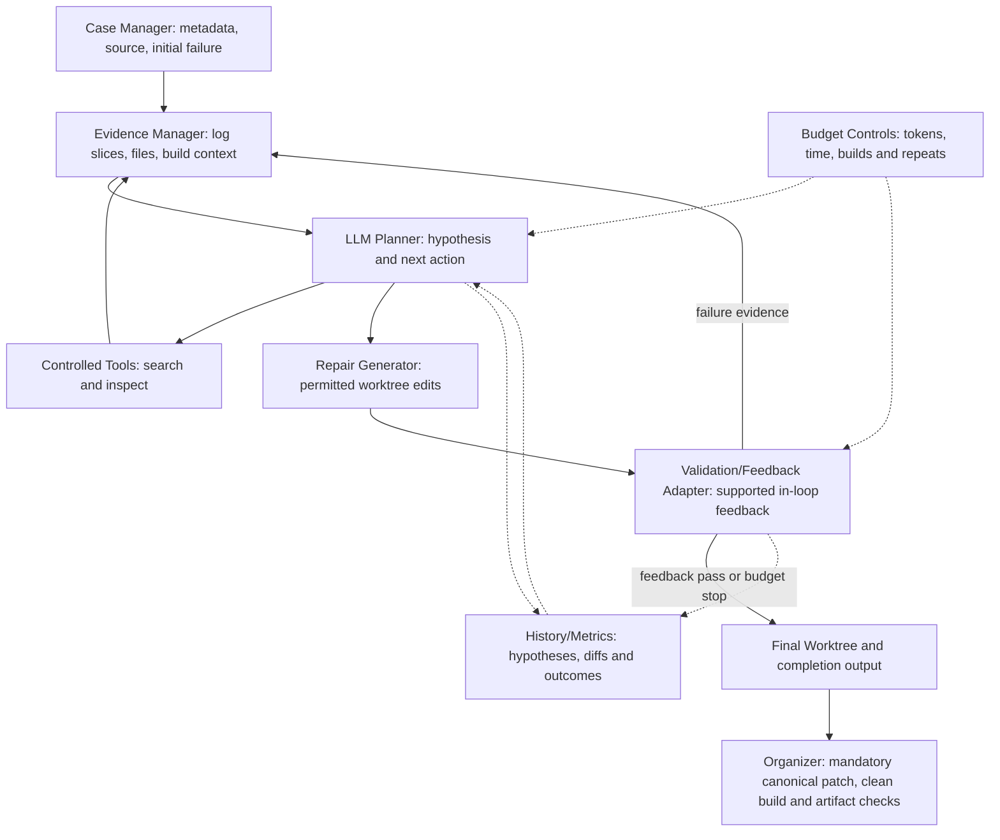

# Design Proposal

**Build-Bench Challenge: Autonomous LLM Agents for Cross-Architecture Package Repair**
**Team:** Anthony Capraru, Austin Li, Joonseo Moon, Juliette Jacques, Owen Zhang
**Mentor:** Minghua Ma, Microsoft

**Demo 1 presenters:** Owen Zhang and Joonseo Moon

**Demo 1:** September 23, 2026. Materials are due at noon on `demo-1`.

This proposal defines the repair-agent design, evaluation plan and milestones for Demo 2, Demo 3 and the final. General repair-agent implementation and public-case evaluation are scheduled for Demo 2.

## 1. Problem

Package maintainers must diagnose software that builds on one instruction set architecture but fails on another. Failures can arise from source assumptions, dependencies, compiler flags, build-system configuration, tests, or packaging. Manual repair requires moving between long logs, unfamiliar source trees, and build metadata, then rebuilding to determine whether a change helped.

We propose a general LLM repair agent that gathers evidence, forms and revises a root-cause hypothesis, edits permitted package files, and requests validation within a fixed resource budget. The desired benefit is less manual investigation with independently verifiable repairs. We will measure repair success and resource cost; this project does not yet measure developer time saved.

**Scope.** Our downloaded release has 200 Debian source-package cases across 188 packages: 100 x86_64-to-aarch64 and 100 in the reverse direction. The competition also advertises RISC-V migrations, but this release contains no RISC-V cases. Initial course experiments cover the two available directions. RISC-V support depends on released cases and permitted infrastructure. [1]

**Scope boundaries.** Agent implementation begins after Demo 1. The project will use an existing LLM rather than train a new model, and repairs must pass the organizer's unchanged validation process. Evaluation claims will be limited to the cases tested.

## 2. Proposed design

### Execution contract

An agent receives `task.json` and initial failure evidence in `/workspace/input`, edits only the permitted repository under `/workspace/work/repo`, and writes structured completion output under `/workspace/output`. The platform derives a canonical patch, applies it to a fresh case, runs the official target build, and checks expected artifacts. Agent completion alone does not establish repair success. We will follow the submission checks, including `agent-result.json`, a README, and exactly pinned dependencies. [1, 3]

The agent will use only permitted tools. It must not receive a Docker socket or start the validator directly. The organizers have since confirmed both hosted interfaces. [4] Model access is an organizer-managed, OpenAI-compatible endpoint serving the same designated model to every team; the model version is not disclosed, connection details and a common per-case usage budget arrive before official evaluation, and personal credentials must not ship in the agent ZIP. In-loop build feedback is supported: the agent may modify its worktree, request a target-architecture build, inspect the outcome and diagnostic excerpts, and continue repairing within a bounded, uniform request limit that the organizers have not yet finalized. Final clean-build validation and artifact checks remain mandatory for a verified repair. The supplied local runner disables agent networking and does not simulate in-run build requests, so our harness must stand in for both during development; Development Validation is the organizer-side route for official-environment checks of repaired public cases, but its published limits mean it cannot serve as our evaluation harness: it accepts only a repaired Worktree Bundle ZIP (a root `manifest.json` plus one `worktree/input/` tree per case, supplied either as a `dpkg-source -x` tree or a rebuilt `.dsc`), it will not run an unrepaired case to reproduce an original failure, it is a web form with no API, and one team may run only one task at a time. We therefore treat it as a ground-truth spot check against our local results, not as a substitute for local case reconstruction. [4, 5] Locally the validator expects `input/` to hold a complete rebuilt Debian source package — the correctly named `.dsc` and every referenced archive with updated checksums, produced by `dpkg-source -b` — so our harness performs the source repackaging that the hosted platform performs for itself. [6] Public-case execution beyond the single supplied environment is not yet established.

**Separate agent and development harness.** The submitted agent contains the repair loop and two adapters: `ModelClient` for model requests and usage, and `BuildFeedback` for an optional build request, structured status and log. A separate Linux harness materializes public cases, holds API credentials, invokes the official validator outside the agent sandbox, and records experiments. For local research we propose a file request/response bridge: the isolated agent writes bounded requests under its output mount; the host validates them and supplies responses through a separate agent-read-only input mount. This bridge is not implemented and is not an organizer-provided interface; the organizers have confirmed it must stay confined to our local research harness and outside the submitted agent contract. [4] The agent receives neither credentials nor a Docker socket. Because local tests do not simulate in-run build requests, the harness supplies that feedback during development and every result identifies which mode produced it. `./bb check` validates the submission, `./bb package` creates its ZIP, and `./bb ready` also runs the example test; packaging alone does not establish end-to-end compatibility.

**Debian case preparation.** The public cases contain compressed source packages and historical logs, not complete runnable validator cases. The harness must reconstruct an unpacked source tree, build configuration and dependency snapshot, then reproduce the original diagnostic as well as the failing build step. The hosted Debian worktree layout and allowed edit paths still need confirmation. Read architecture information from supplied metadata where available, retain its provenance, and mark missing fields unknown. Debian build/host architecture fields describe compilation roles; they do not establish the architecture on which a package previously succeeded.

### Architecture

```mermaid
flowchart TD
    C[Case Manager: metadata, source, initial failure] --> E[Evidence Manager: log slices, files, build context]
    E --> P[LLM Planner: hypothesis and next action]
    P --> T[Controlled Tools: search and inspect]
    T --> E
    P --> R[Repair Generator: permitted worktree edits]
    R --> V[Validation/Feedback Adapter: supported in-loop feedback]
    V -->|failure evidence| E
    V -->|feedback pass or budget stop| F[Final Worktree and completion output]
    F --> O[Organizer: mandatory canonical patch, clean build and artifact checks]
    H[History/Metrics: hypotheses, diffs and outcomes] -.-> P
    P -.-> H
    V -.-> H
    B[Budget Controls: tokens, time, builds and repeats] -.-> P
    B -.-> V
```

| Component | Responsibility and boundary |
| --- | --- |
| Case Manager | Normalize package, architecture, build-stage and input paths without altering the original evidence. |
| Evidence Manager | Stream logs, retain diagnostic windows and source locations, collapse repetitions, and retrieve relevant files within the context budget. |
| LLM Planner | Record a falsifiable hypothesis, choose the next tool or candidate repair, and explain which observed failure it addresses. |
| Controlled Tools | Use bounded Python tools for search, file ranges, snapshot diffs, `debian/rules`, `debian/control`, patch series and architecture guards. Do not assume Git, a compiler or unrestricted shell commands exist in the managed runtime. |
| Repair Generator | Apply candidate UTF-8 text edits to allowed worktree paths and inspect the diff. Preserve required tests and artifacts. |
| Validation/Feedback Adapter | Request in-loop feedback within the organizer's request limit and classify the outcome. Final clean-build validation and artifact checks remain mandatory for verified success. |
| History/Metrics | Persist hypotheses, patch hashes, failure signatures, validation outcomes, tool calls, usage and termination reasons. |
| Budget Controls | Enforce provisional candidate, build, token, wall-time and repeat limits; use stricter organizer limits where applicable. |

### Repair loop and decisions

1. **Observe:** identify the failing stage and preserve diagnostic provenance, including file paths and log offsets.
2. **Diagnose and inspect:** record a suspected cause, supporting log/file locations, repair layer and next discriminating check. Select relevant files/tools and gather confirming or contradicting evidence. A different patch to the same file remains a valid candidate; a coarse hypothesis label alone must not block it.
3. **Repair:** make a bounded candidate change and inspect its diff. Preserve tests and required artifacts; do not treat disabling checks as a general repair strategy.
4. **Validate:** request an in-loop build within the organizer's request limit and record the status and evidence. The mandatory final clean-build validation still follows agent exit.
5. **Revise or stop:** update the hypothesis on failure. Build-stage movement and repeated diagnostics are clues, not proof that an edit helped or harmed. Inspect the new evidence and diff before retaining or reverting a candidate. Stop on verified feedback success, exhausted budgets, or a repeated unchanged failure/patch pair. The platform still performs the final clean validation after exit.

On a self-imposed timeout the agent performs a graceful stop that retains its best selected candidate; it must never restore the original worktree, which would discard a possibly working repair. The organizers raised this directly, and also noted that identical decisions across repeated runs are a research objective of ours rather than a competition requirement — only non-interactive execution is required. [4] Reserve wall-clock time for that graceful stop. Keep an internal termination reason separate from the runner's `completed` protocol status. Caught and uncaught agent exceptions are recorded as agent errors and remain in evaluation counts. A protocol-complete run may still produce no repair. Preflight text edits with the kit's canonical patch generator and clean application in the harness. In rc.2, edits to a file whose original contents lack a final newline can produce a malformed diff; adding a newline only to the edited file is not a guaranteed remedy. Record the compatibility failure rather than modifying the official runner.

We choose bounded evidence retrieval over placing the entire repository and log in context. One downloaded libyuv log is 2.37 GB; noisy repetition would crowd out the relevant source and diagnostics. We choose iterative diagnosis over a single prompt because validation can contradict the first hypothesis. We choose a small explicit state machine and append-only attempt records over an unconstrained conversation so experiments can explain failures and enforce limits. We choose official fresh-build validation over the model's own confidence or an incremental workspace build. [3]

Initial configurable research limits are **5 repair candidates, at most 3 in-loop validation builds where permitted, 30 minutes total wall time per case, 30,000 model tokens, and 2 repeated identical failure/patch pairs**. These are proposed research caps, not published competition limits; the organizers have confirmed a uniform per-case build-request limit is coming and that our caps should stay labeled as research settings. [4] The published rules state that build-feedback, iteration and tool-call budgets, together with CPU, memory, storage, concurrency, network and credential policies, will be published before public evaluation opens; our caps are frozen only after those appear. [5] Use the stricter organizer cap where applicable and freeze the actual settings before comparison. Record token categories supported by the provider; unknown usage stays unknown, never zero. The wall-clock budget includes tool and build requests. Calibrate these caps on the development cases before freezing a comparison; historical time to failure is not an estimate of successful build duration. The one published Case manifest sets `timeout_seconds` to 3600 with `jobs: 2`, so a single validated build may exceed our provisional 30-minute per-case wall-clock cap; that cap is revisited once rcran build durations are measured. [6]

### Implementation and model selection

We will build the agent in Python. Hosted evaluation serves every team the same undisclosed model through an organizer-managed, OpenAI-compatible endpoint, so model choice is not a competition variable and prompts must stay model-agnostic rather than tuned to one provider's behaviour. [4] `ModelClient` therefore targets the OpenAI-compatible request shape with a configurable base URL and no hardcoded model name. Local development still requires our own provider and spending ceiling; any local pilot across candidate models measures our own cost and reliability, and we will not present it as a general model ranking or as evidence about hosted performance.

## 3. What makes this hard

The hardest challenge is selecting the next useful evidence or repair action under an expensive, incomplete feedback loop. A compiler error may be downstream of a dependency problem, and a cross-architecture failure may actually occur during packaging. Repeated noisy logs can hide the causal diagnostic. The planner must connect architecture and build-system facts to a hypothesis, choose an informative tool call, and revise after a failed build without cycling through the same edits.

This requires more than an API call: bounded log extraction with provenance, tool and state management, reproducible validation integration, failure classification, and cost-aware stopping must work together. Our central experiment will test whether evidence selection and repair history increase verified repairs or reduce model usage compared with the Demo 2 prototype. Failure labels from the current log scan are heuristic signals, not established root causes.

## 4. How you will know it worked

**Primary metric:** Verified Build Success Rate = cases whose canonical patch applies, clean target build succeeds, and required artifacts pass verification (numerator) / all cases in the frozen evaluation set (denominator). Results will report the number of verified repairs, total cases, and verified build success rate percentage. Timeouts, invalid patches, crashes, and unresolved cases remain in the denominator. Infrastructure failures will be reported separately without silently removing them; any secondary rate restricted to runnable cases must identify that denominator.

**Secondary metrics:** Total wall time, model token usage, repair candidates, tool calls by type, termination reason, and results by migration direction. Report per-case records and medians, plus failure categories only when manually supported. Build success demonstrates the benchmark outcome, not unrestricted semantic correctness. Patch application requires explicit evidence such as `patch_applied: true`; absence of `invalid_patch` is insufficient when infrastructure failed before application.

Each case/run record includes case and agent versions, split, run ID, model/configuration, budgets, validator status, patch-application evidence, agent termination/error, candidate count, validation requests, tool counts, token usage or unknown, total wall time and paths to the transcript, final diff and validator result. Preserve each row, including attempts that never reach validation.

**Evaluation capacity.** Repeated local measurement currently depends on how many Case environments the organizers supply. One is published; website Development Validation covers the other 199 but runs one task per team at a time through a web form, which cannot produce repeated runs at the volume §4 assumes. We are requesting local environments for the frozen development Case IDs. If capacity does not materialise, the frozen set and repeat counts are revised and the change is announced with its justification at the next demo rather than absorbed silently. [5, 6]

**Comparison plan.** The team will inspect the organizer-linked baseline at a recorded commit and reproduce it using matching cases, model, tool access, and budgets where compatible. If no compatible general-agent baseline is available, the team will document the limitation. Independently of official-baseline availability, the team will run a clearly identified one-shot LLM comparator — log tail only, a single candidate, no repair history — on every frozen case set with the same model, budgets and final validator, because it is the control for our design claim that evidence selection and repair history earn their cost. Later versions will be compared against the frozen Demo 2 prototype. The selected improvement will also be tested with the feature enabled and disabled to measure its contribution. [1, 3]

**Evaluation Cases:** Freeze 10 public cases for Demo 2, aiming for five per direction. For the final evaluation, target is 40 cases with 20 per direction: the original 10 plus 30 held out from model selection, prompt development and strategy tuning. Cases from the same package will remain in the same split. Selection will be recorded before examining repair outcomes, and held-out set will be frozen before Demo 3 optimization.

**Success targets and repeated runs:** Use the same model/configuration and case snapshot for paired comparisons. Run every compared configuration three times on **all 10 development cases**, with a fixed run schedule recorded before optimization. Report per-case outcomes and each run's repair count, plus the mean across all three runs. The Demo 3 repair target is at least one additional repair per 10 cases on average, with a positive net gain in at least two of the three paired runs. For the token target, retain every case repaired by Demo 2 in the corresponding runs, have at least one verified repair overall, and reduce aggregate tokens across all 30 attempts by at least 20%; missing usage cannot satisfy it. Report regressions even when the repair target is met. This avoids selecting only favorable cases for repeats. Evaluate the 40-case final set once per configuration and report the 30-case held-out result separately; disclose the smaller repeat coverage outside the development set. Freeze the improvement criterion before optimization.

### Current evidence (September 21)

- Downloaded materials were inventoried and archived. Dataset checks covered 1,510 listed checksums and 705 per-case source entries with no mismatches. The release contains 200 cases and 188 packages. [2]
- We reproduced the organizer's hello example on Linux, confirming the starter workflow. Our LLM repair agent and public-case evaluation are scheduled for Demo 2. [3]

## 5. Milestones

The following milestones define the deliverables and verification criteria for each course deadline.

| Demo | Date | Milestone | How we will demonstrate it |
| --- | --- | --- | --- |
| Demo 2 | 10/21 | Compatible end-to-end LLM prototype; reproduce starter workflow and baseline or document compatibility blocker. | Runnable packaged agent and exact command. Trace on at least one materialized Debian case shows a reproduced original diagnostic, model call, file inspection, candidate edit, completion output and clean validation attempt. Preserve versions, adapter mode and limits; record `./bb ready` honestly, including compatibility failures. |
| Demo 2 | 10/21 | Freeze and evaluate 10 public cases, aiming for 5 per direction. | Checked-in case manifest and reproducible experiment command. Per-case verified status, wall time, tokens, attempts and tool calls, including failures. No minimum repair rate promised. |
| Demo 3 | 11/16 | Implement evidence-driven iterative hypothesis revision based on Demo 2 failure analysis. | Record a failure taxonomy with concrete traces and implement a repair-history mechanism that uses prior hypotheses, edits, and validation results to revise subsequent repair attempts. Place the change behind a configuration flag and perform an ablation against the frozen Demo 2 agent. |
| Demo 3 | 11/16 | Demonstrate measurable improvement over the Demo 2 agent on the same 10 development cases. | Compare against the frozen Demo 2 agent using Verified Build Success Rate as the primary metric. Target at least 1 additional verified repair per 10 cases on average. For secondary metrics, target at least a 20% reduction in aggregate model-token usage, 15% reduction in median wall time, or 20% reduction in average repair attempts per case while maintaining or improving Verified Build Success Rate. Report tool calls, termination reasons, and results by migration direction. Run each configuration three times under identical model and budget limits and report all improvements and regressions. |
| Final | 12/09 | Stable agent and reproducible evaluation on the 40-case target set. | Pinned dependencies, agent version, case manifests, exact setup/commands, expected outputs, raw records, limits and failure analysis. Compare official baseline where reproducible, Demo 2, Demo 3 and final versions under a documented common setup. |
| Final | 12/09 | Implement a second evidence-driven improvement targeting the largest failure category remaining after Demo 3. | Update the failure taxonomy using Demo 3 results and implement a second targeted improvement. Compare against the frozen Demo 3 agent on the same 10 development cases using Verified Build Success Rate as the primary metric. Target at least 1 additional verified repair per 10 cases on average. For secondary metrics, target at least a 20% reduction in aggregate model-token usage, 15% reduction in median wall time, or 20% reduction in average repair attempts per case while maintaining or improving Verified Build Success Rate. Hold model and budget ceilings fixed, disclose regressions, and evaluate the final agent separately on the 30 held-out cases. |
| Final | 12/09 | Competition-ready packaging and a qualified Agent version selected for official evaluation. | Team registration completed before the 30 September 2026 close. [5] Qualification requires uploading a version that passes the platform checks and the Hosted Smoke Test, then selecting one qualified version in My Submissions **before the end of 13 November 2026, Beijing time (UTC+8)** — ahead of Demo 3, not at the December final. Archive the validation report and the submission receipt, or record a specific blocker. |

## 6. Risks

| Risk | Mitigation and evidence needed |
| --- | --- |
| Only one public case has a local build environment | The 200 cases ship source and failure logs; frozen local build environments are excluded. The organizers supply one complete environment, `buildbench-local-rcran-v1` (388 MB for a single case), and instruct participants not to generate buildconfigs or dependency versions from public dataset metadata. [6] Develop the harness against that case, request further Case environments from the organizers by Case ID, and use website Development Validation as a ground-truth spot check. Reconstructing environments ourselves is explicitly out of scope. |
| Hosted interfaces confirmed, but not reproducible locally | Resolved in principle: the organizers confirmed an OpenAI-compatible model endpoint and in-loop build feedback. [4] Remaining exposure is that the local runner simulates neither, and the per-case build-request limit is unset. Build both adapters against configurable endpoints, have the harness stand in during development, Development Validation has been checked and does not reduce the reconstruction scope. [5] The organizers also describe bounded hosted build feedback as a planned feature absent from rc.2, so the local stand-in is required rather than temporary convenience. Preserve runtime isolation; do not add a Docker socket or assume outbound networking. |
| Sparse, misleading or huge logs | Stream and deduplicate with source offsets; measure extraction failures and inspect representative traces. |
| Hallucinated edits or package-specific overfitting | Validate clean builds, retain required tests/artifacts, review recurring failure categories, and hold out package groups from tuning. |
| AWS capacity, cost and target environments | The local validator runtime is `linux/arm64`, so the development host is a native Linux **ARM64** instance with Docker, at least 8 GiB memory and 10 GiB free disk; validation runs a privileged container and belongs on a disposable machine. An x86_64 host needs a `qemu-aarch64` binfmt handler with the `F` flag even for `--check`, a combination the organizers have not tested end to end. [6] We plan to run course-scale experiments on AWS using reproducible ARM64 and x86_64 environments. Before comparisons, pin instance type, machine image, Docker version, container image digests and configuration. Set the model and compute spending budget, then verify provisioning, cost and capacity before running comparisons. RISC-V resources remain outside the current public-case plan. |
| Performance gain does not materialize | Keep the predefined comparison, show negative results/regressions, and announce any scope revision. Do not cherry-pick successful cases. |
| Competition and course timelines differ | Participation is decided and the team is registered. [5] The binding external date is the 13 November 2026 (UTC+8) version-selection freeze, which precedes Demo 3 on 11/16, so the competition version is prepared against an earlier internal schedule than the course milestones imply. Results are published by 20 November 2026. |

Demo 1 presenters are **Owen Zhang and Joonseo Moon**.

### References

1. [Official Build-Bench Challenge](https://matrix.cstcloud.cn/build-bench/), inspected September 21, 2026: execution/scoring, architecture scope, organizer baseline link and timeline. [Organizer-linked baseline repository](https://github.com/AIOps-Lab-NKU/BuildBench-Agent-Baseline). Baseline compatibility and results have not been verified. The site cites Zhao et al., [Can Language Models Go Beyond Coding?](https://arxiv.org/abs/2511.00780); no literature performance number is used as our baseline.
2. [Dataset summary and provenance](https://github.com/ec528-fall26/build-bench/blob/5f5a9f946f5da3ef42925b6fe6e8d1d2f0914db9/docs/evidence/demo-1/dataset-summary.json), derived from `analysis/dataset-analysis.json` inside the [downloaded materials snapshot](https://github.com/ec528-fall26/build-bench/blob/624f2b6/materials/README.md). Full analysis and input hashes reside in that snapshot.
3. [Archived run results and reproduction instructions](https://github.com/ec528-fall26/build-bench/blob/5f5a9f946f5da3ef42925b6fe6e8d1d2f0914db9/docs/evidence/demo-1/README.md). Interface descriptions also come from the supplied rc.2 starter kit's README, AGENTS.md and runner inspection. The runtime contract is documented in the [archived starter kit](https://github.com/ec528-fall26/build-bench/blob/5f5a9f946f5da3ef42925b6fe6e8d1d2f0914db9/buildbench-starter-kit-0.1.0-rc.2/README.md), its `runner/` and `AGENTS.md`.
4. Build-Bench Organizing Team, email reply to the team's interface questions, received September 2026: organizer-managed OpenAI-compatible model endpoint with an undisclosed common model and per-case usage budget; confirmed in-loop build feedback within a uniform request limit that is not yet finalized; Development Validation for official-environment checks of repaired public cases; host-side file bridge to remain outside the submitted agent contract; determinism not a competition requirement; graceful stop should retain the best candidate; rc.2 final-newline patch edge case reproduced by the organizers and under review.
5. Official Build-Bench Challenge website, pages inspected 30 September 2026: [Development Validation](https://matrix.cstcloud.cn/build-bench/development-validation.html) (repaired Worktree Bundle ZIP only, `manifest.json` plus `worktree/input/` per case, one task per team at a time, web upload, results excluded from the leaderboard), [Rules](https://matrix.cstcloud.cn/build-bench/rules.html) (team registration by a team leader; budgets and resource policies pending publication), [Submission](https://matrix.cstcloud.cn/build-bench/submission.html) (Hosted Smoke Test shares the Agent Runner, workspace layout and status schema with Full Evaluation over lightweight qualification cases; version selection by end of 13 November 2026 UTC+8), [FAQ](https://matrix.cstcloud.cn/build-bench/faq.html) (bounded hosted build feedback described as planned and absent from rc.2), and the front-page timeline (registration closed 30 September 2026; results by 20 November 2026).
6. Local Validator Example `buildbench-local-rcran-v1`, README and `case/manifest.json`, inspected 30 September 2026: one complete local environment for Case `launchpad-mantic-amd64-arm64-r-cran-digest-7a42effc961f` (x86_64 to aarch64) with validator schema 1.0 manifest, official target buildconfig, `dependency-lock.json`, frozen target and `all` DEBs, `linux/arm64` runtime image and `run.sh`; participants are instructed not to generate build configuration or dependency versions from public dataset metadata, and to contact the organizers for another Case's frozen local environment.
