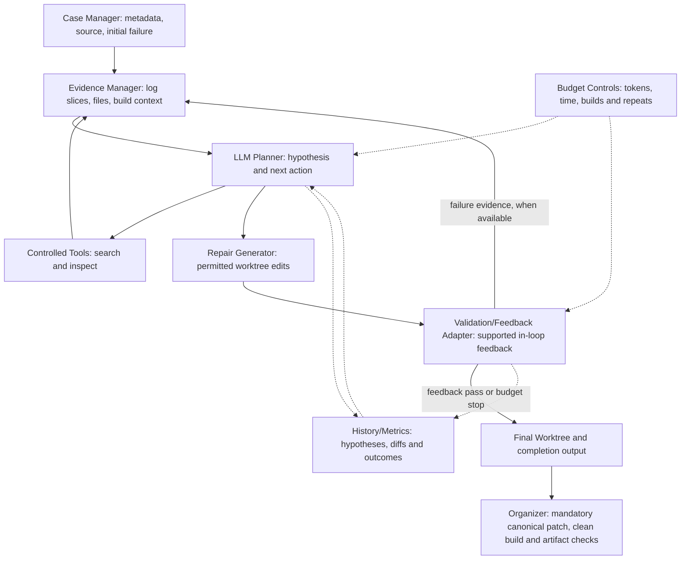

# Proposed repair agent architecture

All components are proposed. In-loop build feedback depends on the supported interface. Final clean-build validation and artifact checks are always required for verified success. The presentation diagram summarizes the flow; the Mermaid diagram below shows the tool/evidence loop and final organizer validation explicitly.

[Presentation diagram PDF](architecture.pdf) · [Editable Mermaid source](architecture.mmd) · [Design proposal](../design-proposal.md)
